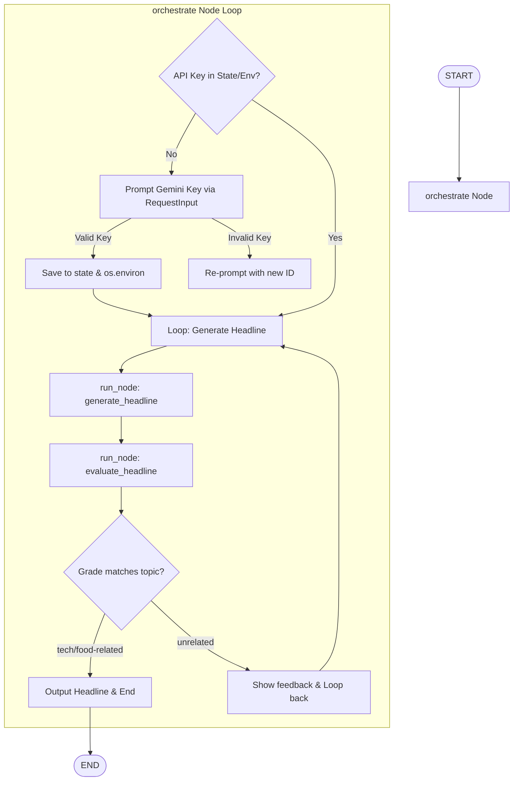

# ADK Dynamic Gemini Key & Headline Loop Agent

This project demonstrates a looping workflow agent built with the **Google Antigravity SDK (ADK)**. It showcases how to dynamically prompt a user for their **Google Gemini API Key** at runtime, validate it immediately, persist it securely in session state/environment, and run a headline generation/evaluation loop inside a single orchestrator node.

---

## 🏗️ Workflow Architecture

Unlike graphs that route between different nodes via defined edges, this agent uses a **Single-Node Orchestrator** pattern. The entire control flow (key validation, generation, and validation loops) is managed dynamically within Python code inside a single node.



---

## 🚀 Getting Started

### 📋 Prerequisites
Ensure your virtual environment is active and all dependencies are installed:
```bash
source .venv/bin/activate
```

### 💻 Running the CLI Agent
To run the workflow interactively directly inside the terminal:
```bash
.venv/bin/adk run dynamic_nodes
```

### 🌐 Running the Web UI
To interact with the agent through the visual developer interface:
```bash
.venv/bin/adk web dynamic_nodes --port 8080
```
Then open your web browser and navigate to:
👉 **[http://localhost:8080](http://localhost:8080)**

---

## 💡 Core Principles & Best Practices

When building dynamic, user-interactive workflows in ADK, keep the following core principles in mind:

### 1. Single-Node Orchestration vs. Graph-Edge Routing
Instead of declaring complex graph edges in the `Workflow` constructor, you can define a single node (e.g. `orchestrate`) and use `await ctx.run_node(agent_instance)` to execute other sub-agents dynamically. This allows you to write standard, readable Python control flow (`while`, `if/else`, `try/except`) to govern your agent's behavior.

### 2. Dynamic Interrupt IDs (Avoiding UI Lockups)
When prompting the user multiple times (e.g., repeatedly asking for an API key upon validation failure or prompting in a continuous loop), **never reuse the same interrupt ID**.
* **Why**: The ADK Web UI tracks responses by mapping them to unique prompt IDs in the session history. If the backend yields a `RequestInput` with an ID that has already been resolved, the frontend UI client treats it as a historical replay. This causes the UI input box to freeze or lock up.
* **The Solution**: Generate a unique, state-based dynamic ID for each prompt turn by tracking a counter in `ctx.state` and clearing the active prompt ID upon receiving user input:
  ```python
  interrupt_id = ctx.state.get("gemini_api_key_interrupt_id")
  if not interrupt_id:
      counter = ctx.state.get("gemini_api_key_counter", 0) + 1
      ctx.state["gemini_api_key_counter"] = counter
      interrupt_id = f"gemini_api_key_{counter}"
      ctx.state["gemini_api_key_interrupt_id"] = interrupt_id
  ```

### 3. Dynamic Environment Variable Propagation
Under the hood, ADK `Agent` instances (which are configured with the Gemini client) look up environment variables such as `GEMINI_API_KEY` when executing. By dynamically writing the user-provided key to `os.environ["GEMINI_API_KEY"]` inside the orchestrator pre-hook, downstream sub-agents automatically inherit and use the key without requiring manual passing.

### 4. Explicit Event Roles
All events yielded by nodes representing responses/messages to the user should have their role explicitly set to `"model"`:
```python
yield Event(
    content=types.Content(
        role="model",
        parts=[types.Part.from_text(text="Your message here")]
    )
)
```
If you yield events using simple text messages or let the SDK serialize default user-role events sequentially, the Web UI's turn-taking mechanism will break, leading to UI thread lockups.

### 5. Robust Input Validation Loops
Always validate user credentials or critical inputs before caching them. If a validation check fails (such as an invalid API key causing a test generation call to fail), immediately inform the user, clear the temporary state, and yield a fresh `RequestInput` with a new unique ID to resume the loop.
