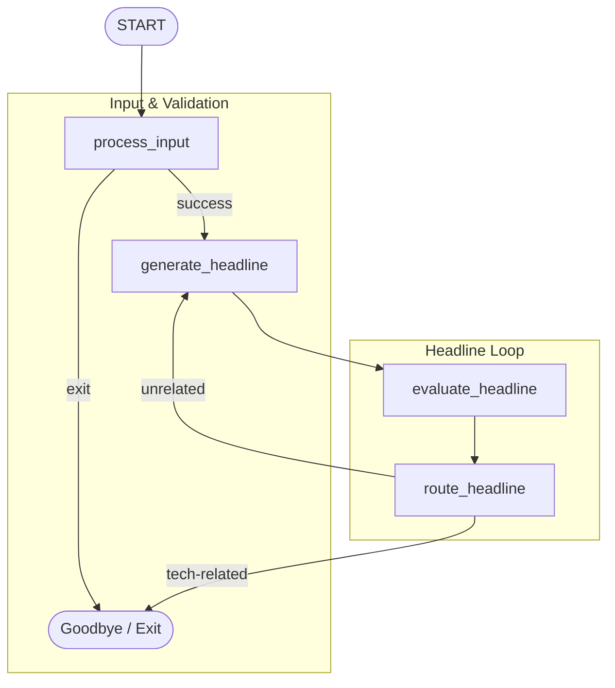

# ADK Graph-Based Headline Loop Agent

This project demonstrates a looping workflow agent built with the **Google Antigravity SDK (ADK)**. It showcases how to dynamically validate the **Google Gemini API Key** at runtime, process a topic, and run a headline generation/evaluation loop governed by explicit **graph-edge routing**.

---

## 🏗️ Workflow Architecture

Unlike the single-node orchestration pattern, this agent uses a **Graph-Based Looping** pattern, where execution moves between nodes based on explicit transition rules defined in the workflow's edge dictionary.



### Nodes Definition
1. **`process_input`**:
   - Prompts for and validates the Gemini API key if missing from session state or environment.
   - Saves the user's input topic to `ctx.state["topic"]`.
   - Routes to `"success"` if validation passes, or `"exit"` if the user cancels.
2. **`generate_headline`**:
   - An LLM agent that writes a headline on the `{topic}` stored in the state, incorporating any feedback from the evaluator.
3. **`evaluate_headline`**:
   - An LLM agent that grades the generated headline to determine if it is related to technology or software engineering, returning a structured `Feedback` model.
4. **`route_headline`**:
   - A router node that returns an event routing to either `"tech-related"` (matches target topic) or `"unrelated"`.

---

## 🚀 Getting Started

### 📋 Prerequisites
Ensure your virtual environment is active and all dependencies are installed:
```bash
source .venv/bin/activate
```

### 💻 Running the CLI Agent
To run the workflow interactively directly inside the terminal:
```bash
.venv/bin/adk run loop
```

### 🌐 Running the Web UI
To interact with the agent through the visual developer interface:
```bash
.venv/bin/adk web loop --port 8080
```
Then open your web browser and navigate to:
👉 **[http://localhost:8080](http://localhost:8080)**

---

## 💡 Core Principles & Best Practices

### 1. Rerun-on-Resume (`@node(rerun_on_resume=True)`)
When a node yields a `RequestInput` (suspending the workflow), it halts execution. When the workflow resumes with the user's response:
- If a node is **not** marked `rerun_on_resume=True`, the workflow runner bypasses it and attempts to recover its output directly. Consequently, any code written *after* the suspend point (such as `yield Event(state={"topic": node_input})`) is skipped, leading to missing state variables (like `topic`) and causing downstream `KeyError` crashes.
- Decorating the input processing function with `@node(rerun_on_resume=True)` ensures the node is re-run upon resumption, validating the newly supplied credentials and successfully writing the topic to state.

### 2. Conditional Routing vs. Unconditional Chaining
When defining graph edges, sequentially listing nodes in a tuple (e.g., `(START, process_input, generate_headline, ...)`) creates unconditional transitions. The runner will execute `generate_headline` even if `process_input` yielded `route="exit"`.
To support graceful exit paths:
- Define explicit routing dictionaries for nodes that can terminate early:
  ```python
  edges=[
      ("START", process_input),
      (process_input, {
          "success": generate_headline,
      }),
  ]
  ```
- Because there is no edge mapped to the `"exit"` route, the workflow will gracefully terminate when the user types `exit`, instead of proceeding to downstream nodes and raising errors due to missing context.
