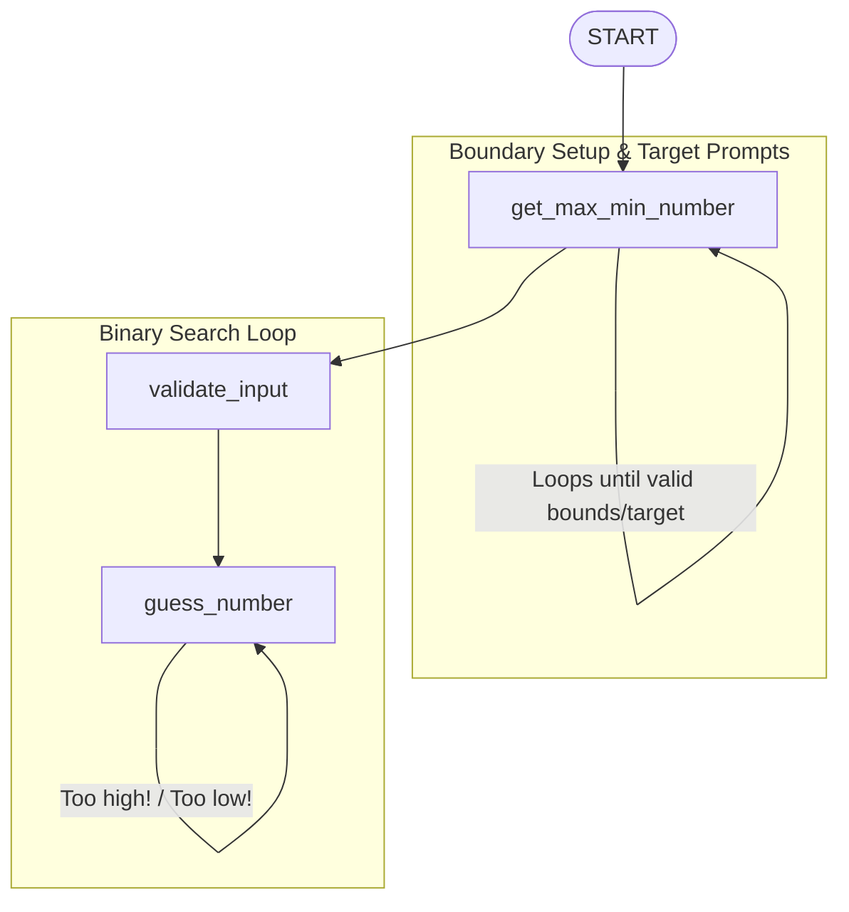

# ADK Graph-Based Number Guessing Loop Agent

This project demonstrates a looping workflow agent built with the **Google Antigravity SDK (ADK)**. It showcases how to dynamically validate the **minimum and maximum bounds** at runtime, prompt for a target number, and run a binary search guessing loop governed by **graph-edge routing**.

---

## 🏗️ Workflow Architecture

The agent uses a **Graph-Based Looping** pattern, where execution moves between nodes based on explicit transition rules defined in the workflow's edge list.



### Nodes Definition
1. **`get_max_min_number`**:
   - Prompts for and validates the `min_number` and `max_number` sequentially if missing from session state.
   - Loops using `RequestInput` with unique `interrupt_id` fields until both numbers are valid integers and `max_number > min_number`.
   - Once the bounds are valid, prompts for and waits for the target guessing number.
   - Saves the bounds in context and yields the target guessing number to route to `validate_input`.
2. **`validate_input`**:
   - Parses the user's input string into an integer.
   - Validates that the number falls within the active bounds (`min_number` and `max_number` retrieved from `ctx.state`).
   - Yields the validated number to the session state under `target_number`.
3. **`guess_number`**:
   - Generates a random guess between the current `min_number` and `max_number` bounds.
   - If correct, resets the bounds back to $0$ and $100$ and yields a completion message.
   - If the guess is too high, updates the upper bound `max_number` in `ctx.state`, outputs a `"Too high!"` message, and routes to `"Too high!"` to guess again.
   - If the guess is too low, updates the lower bound `min_number` in `ctx.state`, outputs a `"Too low!"` message, and routes to `"Too low!"` to guess again.

---

## 🚀 Getting Started

### 📋 Prerequisites
Ensure your virtual environment is active and all dependencies are installed:
```bash
source .venv/bin/activate
```

### 💻 Running the CLI Agent
To run the workflow interactively directly inside the terminal:
```bash
.venv/bin/adk run loop_self
```

### 🌐 Running the Web UI
To interact with the agent through the visual developer interface:
```bash
.venv/bin/adk web loop_self --port 8080
```

Then open your web browser and navigate to:
👉 **[http://localhost:8080](http://localhost:8080)**

---

## 💡 Core Principles & Best Practices

### 1. Explicit Node Output Propagation
In ADK, when sequential nodes in a workflow expect data inputs (e.g. `node_input: str`), the preceding node must explicitly pass its output:
- Generator functions that only yield state updates (`yield Event(state=...)`) do not produce a node output value, leaving the runner's `ctx.output` as `None`.
- Passing `None` to a downstream node with a typed signature (like `validate_input(node_input: str)`) results in a Pydantic `ValidationError`.
- **The Solution**: Populate the `output` attribute when yielding the event:
  ```python
  yield Event(state={'min_number': min_number, 'max_number': max_number}, output=choice_str)
  ```

### 2. State-Based Parameter Binding
By default, the parameter binding mode for Python function nodes in ADK is `'state'`. 
- If a function parameter (like `target_number: int`) does not map to `node_input`, the ADK runner resolves it directly from the session state (`ctx.state`).
- This allows looping nodes (like `guess_number`) to easily share and read state variables set by earlier nodes (`validate_input`) across multiple execution cycles without manually passing inputs through every intermediate hop.

### 3. Consolidating Self-Looping Transitions in Graphs
The ADK `Workflow` validator checks for duplicate edges between nodes based on their names `(from_node.name, to_node.name)`, regardless of route values. Thus, writing multiple edge dicts (e.g., one for `'Too high!'` and one for `'Too low!'`) starting and ending on `guess_number` raises a `Duplicate edge found` validation error.
- **The Solution**: Import the `Edge` class from `google.adk.workflow` and express all looping paths between the same nodes in a single `Edge` object:
  ```python
  Edge(from_node=guess_number, to_node=guess_number, route=['Too high!', 'Too low!'])
  ```
