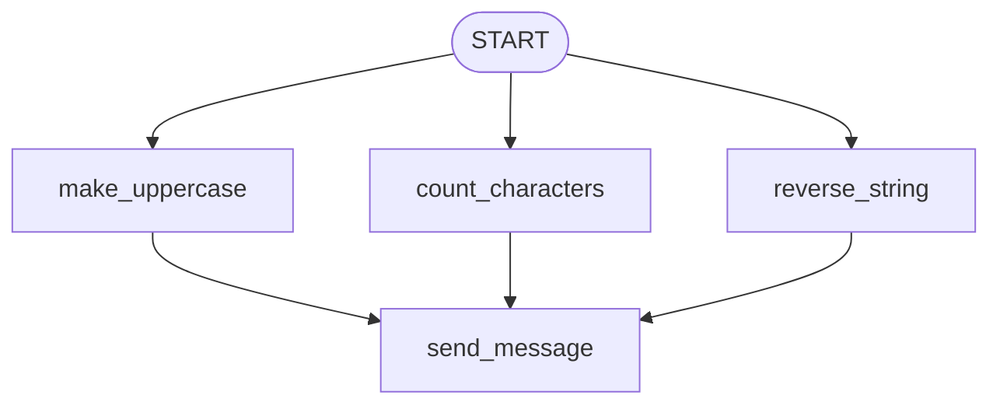

# ADK Parallel Multi-Triggers Workflow Agent

This project demonstrates parallel execution and independent triggering patterns in the **Google Antigravity SDK (ADK)**. It showcases how a single start input can fan out to multiple concurrent branches, and how those branches can trigger the same downstream node independently without a synchronization barrier (no `JoinNode`).

---

## 🏗️ Workflow Architecture

The entry string input is validated against the workflow's input schema and immediately fans out to three concurrent nodes. Because there is no join barrier, `send_message` is triggered **three times**—once for each node's completion.



### Nodes Definition

1. **`make_uppercase`**:
   - Converts the input string to uppercase.
2. **`count_characters`**:
   - Calculates the character count (length) of the input string.
3. **`reverse_string`**:
   - Reverses the order of characters in the input string.
4. **`send_message`**:
   - Yields a message displaying the result of the specific branch that triggered it.

---

## 🚀 Getting Started

### 📋 Prerequisites
Ensure your virtual environment is active and all dependencies are installed:
```bash
source .venv/bin/activate
```

### 💻 Running the CLI Agent
To run the workflow interactively directly inside the terminal:
```bash
.venv/bin/adk run multi_triggers
```

### 🌐 Running the Web UI
To interact with the agent through the visual developer interface:
```bash
.venv/bin/adk web multi_triggers --port 8080
```
Then open your web browser and navigate to:
👉 **[http://localhost:8080](http://localhost:8080)**

---

## 💡 Core Principles & Best Practices

### 1. Input Schema Enforcement
Workflows can declare validation rules on their entry inputs using `input_schema`. In this agent, the input is constrained to strings:
```python
root_agent = Workflow(
    name="root_agent",
    edges=[...],
    input_schema=str,
)
```
If a user attempts to submit a non-string value (e.g. an integer or dictionary) as the starting input, the runner will raise a schema validation error.

### 2. Tuple-Based Parallel Fan-Out
To execute multiple nodes concurrently from a single predecessor, group them in a nested tuple within the chain:
```python
edges=[(
    "START",
    (make_uppercase, count_characters, reverse_string), # Fan-out
    send_message,
)]
```

### 3. Multi-Triggering (Fan-Out without a Join Barrier)
By default, placing a single node (`send_message`) immediately after a parallel tuple:
- Registers the downstream node as a successor for each individual branch.
- Operates without a synchronization barrier, meaning the downstream node runs immediately whenever **any** of the preceding nodes finishes.
- Executes the downstream node exactly $N$ times (where $N$ is the number of parallel branches).

### 4. Handling Heterogeneous Inputs
Because the parallel nodes return different datatypes (`make_uppercase` and `reverse_string` return `str`, whereas `count_characters` returns `int`), the downstream `send_message` node must be typed to accept `Any` or handle dynamic type parsing:
```python
async def send_message(node_input: Any):
    yield Event(message=f"Triggered for input: {node_input}")
```
The SDK runtime automatically maps and forwards the exact return value of each completed branch node directly into the `node_input` parameter.
