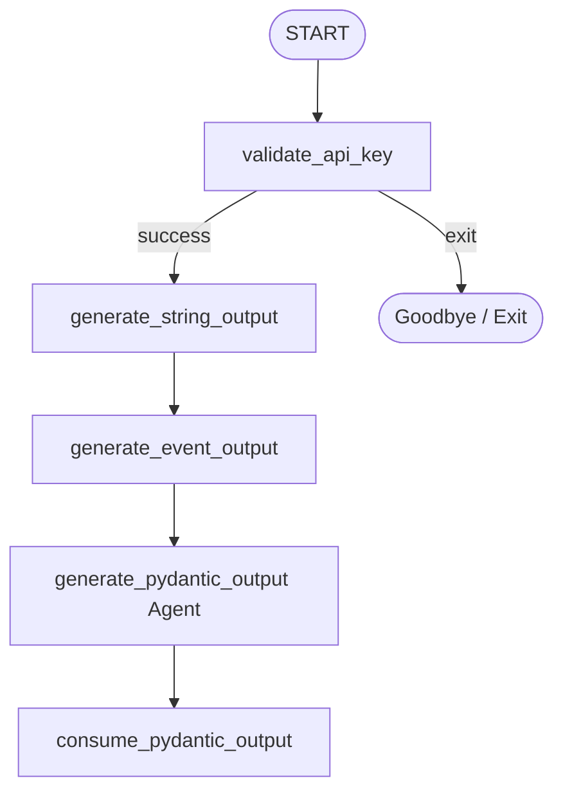

# ADK Node Output Types & Pydantic Coercion Agent

This project demonstrates the output type handling and Pydantic model coercion features of the **Google Antigravity SDK (ADK)**. It showcases how workflow nodes can return simple strings, explicit `Event` wrappers, or structured Pydantic data schemas, and how downstream nodes automatically coerce incoming data into strongly-typed objects.

---

## 🏗️ Workflow Architecture

The parent workflow (`root_agent`) validates credentials and runs a sequential execution chain. The chain demonstrates the passage of data from raw strings to event objects, structured Pydantic models generated by an LLM agent, and finally a consumer function.



### Nodes & Models Definition

- **`TopicDetails` (Pydantic Model)**:
  - Defines the expected schema for the generated topic with fields: `title`, `description`, and `category`.
- **`validate_api_key`**:
  - Prompts for and validates the Gemini API key. Routes to `"success"` if valid.
- **`generate_string_output`**:
  - Accepts a string and returns a formatted string. Demonstrates implicit wrapper behavior.
- **`generate_event_output`**:
  - Explicitly returns an `Event` object containing the output string.
- **`generate_pydantic_output` (Agent)**:
  - An LLM agent configured with the `TopicDetails` class as its `output_schema`. It generates structured JSON matching the model.
- **`consume_pydantic_output`**:
  - A function node that accepts `TopicDetails` as its `node_input`. Demonstrates automatic type coercion.

---

## 🚀 Getting Started

### 📋 Prerequisites
Ensure your virtual environment is active and all dependencies are installed:
```bash
source .venv/bin/activate
```

### 💻 Running the CLI Agent
To run the workflow interactively directly inside the terminal:
```bash
.venv/bin/adk run node_output
```

### 🌐 Running the Web UI
To interact with the agent through the visual developer interface:
```bash
.venv/bin/adk web node_output --port 8080
```
Then open your web browser and navigate to:
👉 **[http://localhost:8080](http://localhost:8080)**

---

## 💡 Core Principles & Best Practices

### 1. Implicit Event Wrapping
For simple nodes, you do not need to construct an `Event` object manually. Returning a raw value (e.g. `str`, `int`, `dict`) from a function node causes the ADK framework to automatically wrap it inside an `Event(output=...)` before sending it downstream:
```python
def generate_string_output(node_input: str):
    return f"Processed input: {node_input}"
```

### 2. Explicit Event Wrapping
When you require fine-grained control over routing (using `route="..."`) or state modifications (using `state={...}`), return an explicit `Event` object:
```python
def generate_event_output(node_input: str):
    return Event(output=f"Event wrapped output: {node_input}", route="success")
```

### 3. Structured LLM Generation (`output_schema`)
By supplying a Pydantic class to the `output_schema` parameter of an `Agent`, you force the LLM to output structured JSON matching that exact schema:
```python
generate_pydantic_output = Agent(
    name="generate_pydantic_output",
    instruction="Generate a creative topic...",
    output_schema=TopicDetails,
)
```
The SDK automatically appends formatting instructions and handles parsing of the LLM response.

### 4. Automatic Downstream Coercion
When a downstream node defines a Pydantic model as the type annotation of its `node_input` argument, the ADK framework automatically coerces the incoming dictionary or JSON payload into an instance of that Pydantic class:
```python
def consume_pydantic_output(node_input: TopicDetails):
    # node_input is automatically instantiated as a TopicDetails object
    return f"Title: {node_input.title}"
```
This removes the need for manual dictionary parsing or validation code inside function nodes.

### 5. Chained Sequential Graph Notation
Instead of splitting the sequence into individual transitions, consecutive unconditional steps can be grouped in a single chained tuple to simplify the graph structure:
```python
root_agent = Workflow(
    name="root_agent",
    edges=[
        ("START", validate_api_key),
        (
            validate_api_key,
            {"success": generate_string_output},
            generate_event_output,
            generate_pydantic_output,
            consume_pydantic_output,
        )
    ],
)
```
