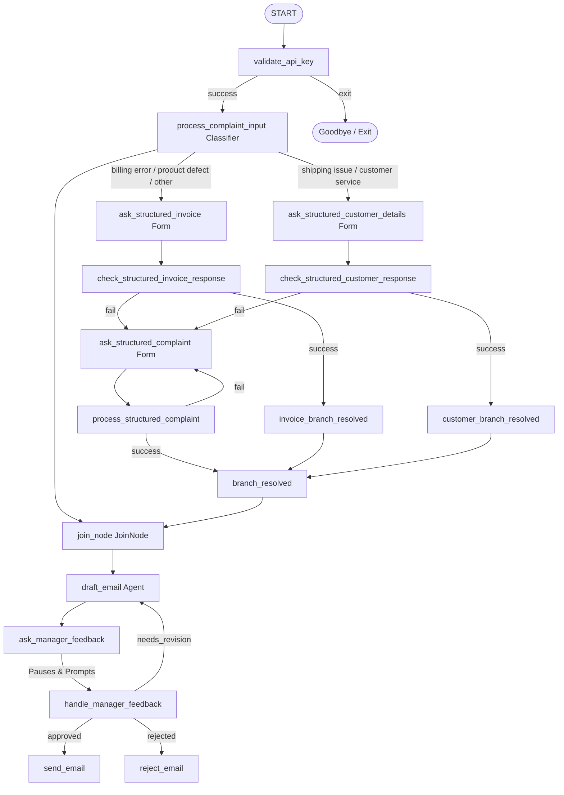

# ADK Human-in-the-Loop (HITL) Draft Review Agent

This project demonstrates how to incorporate **Human-in-the-Loop (HITL)** reviews, structured forms, and LLM-based categorization into your workflows using the **Google Antigravity SDK (ADK)**. 

It showcases how to categorize a user's initial complaint using an LLM classifier, conditionally branch to collect either structured invoice details or customer details using dynamic forms, validate all human inputs, merge the fanned-out branches without deadlocks, and implement a manager review loop to refine the final output.

---

## 🏗️ Workflow Architecture

The parent workflow (`request_input`) validates credentials, classifies the complaint category, routes to collect the corresponding structured details (either invoice or customer details), joins the parallel branches using a `JoinNode`, drafts a response email, and interrupts execution to wait for a manager review.



### Nodes & Models Definition

- **`ComplaintCategory`**:
  - Pydantic model for classification results containing the chosen route, complaint summary, customer details, and initial feedback.
- **`InvoiceRequest`**:
  - Pydantic model defining invoice details: `vendor` (optional), `amount` (compulsory), `invoice_number` (compulsory), `invoice_date` (optional), `subscription_type` (optional), `account_number` (optional), and `payment_method` (optional).
- **`CustomerDetails`**:
  - Pydantic model defining customer details where only `customer_name` and `phone_number` are compulsory, while `account_number`, `email`, and `shipping_address` are optional (default to `None`).
- **`ComplaintDetails`**:
  - Pydantic model for structured complaints where `customer_name` and `complaint` are compulsory, and `product_name`, `order_number`, `customer_account_number`, and `customer_phone` are optional (default to `None`).
- **`validate_api_key`**:
  - Prompts for and validates the Gemini API key.
- **`process_complaint_input`**:
  - Classifies the initial customer complaint into categories using LLM and sets `ctx.route` to steer the workflow.
- **`ask_structured_invoice` / `ask_structured_customer_details`**:
  - Renders the structured form in the Web UI according to the respective Pydantic schemas.
- **`check_structured_invoice_response` / `check_structured_customer_response`**:
  - Validates the returned form input (e.g., checks that the invoice number is `"12345"` or the phone is `"1234567890"` and name is `"Paul"`).
- **`ask_structured_complaint` / `process_structured_complaint`**:
  - Prompts the user to fill out a structured complaint form if any validation in the primary branch fails.
- **`branch_resolved`**:
  - Merges the fanned-out branches conditionally to prevent `JoinNode` blocks.
- **`join_node` (JoinNode)**:
  - Joins the classified complaint and the validated form branch results.
- **`draft_email` (Agent)**:
  - LLM agent that drafts a response email using optional placeholder variables (`{invoice?}`, `{customer?}`, and `{structured_complaint?}`).
- **`ask_manager_feedback` / `handle_manager_feedback`**:
  - Prompts the manager for approval or feedback and handles looping back for draft revisions.

---

## 🚀 Getting Started

### 📋 Prerequisites
Ensure your virtual environment is active and all dependencies are installed:
```bash
source .venv/bin/activate
```

### 💻 Running the CLI Agent
To run the workflow interactively directly inside the terminal:
```bash
.venv/bin/adk run request_input
```

### 🌐 Running the Web UI
To interact with the agent through the visual developer interface:
```bash
.venv/bin/adk web request_input --port 8080
```
Then open your web browser and navigate to:
👉 **[http://localhost:8080](http://localhost:8080)**
