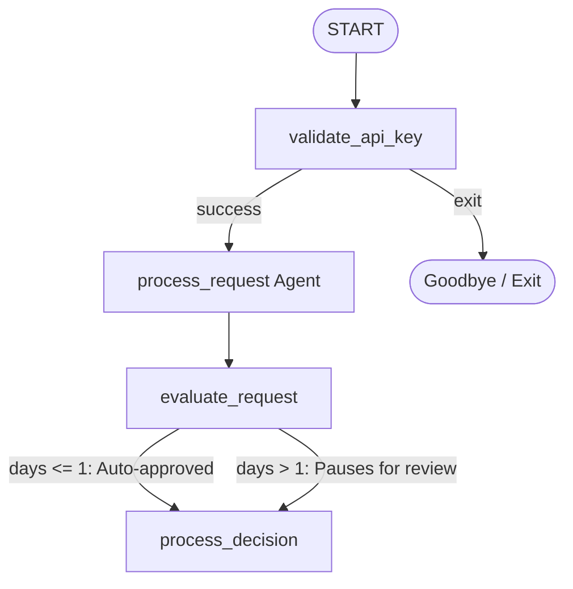

# ADK Advanced Human-in-the-Loop (HITL) Structured Review Agent

This project demonstrates how to implement **Structured Human-in-the-Loop (HITL) Approvals** using the **Google Antigravity SDK (ADK)**. It showcases how to pause execution using `RequestInput`, attach structured payloads, and enforce a **Pydantic Response Schema** on the human reviewer's input (rendering forms in the Web UI).

---

## 🏗️ Workflow Architecture

The parent workflow (`request_input_advanced`) parses a natural language time off request, evaluates the request duration, and either auto-approves it or pauses to prompt a manager for a structured approval decision.



### Nodes & Models Definition

- **`TimeOffRequest` (Pydantic Model)**:
  - Defines the extraction fields: `days` (integer) and `reason` (string).
- **`TimeOffDecision` (Pydantic Model)**:
  - Defines the manager's structured input schema: `approved` (boolean) and optional `approved_days` (integer).
- **`validate_api_key`**:
  - Validates the Gemini API credentials.
- **`process_request` (Agent)**:
  - Extracts request fields from the natural language query into a `TimeOffRequest` Pydantic object.
- **`evaluate_request`**:
  - Directs routing based on request length:
    - **`days <= 1`**: Directly returns a `TimeOffDecision(approved=True)` (Auto-approved).
    - **`days > 1`**: Returns a structured `RequestInput` with the request `payload` attached and `response_schema` set to `TimeOffDecision` to prompt the manager.
- **`process_decision`**:
  - Processes the decision (whether auto-approved or manager-selected) and yields the outcome message.

---

## 🚀 Getting Started

### 📋 Prerequisites
Ensure your virtual environment is active and all dependencies are installed:
```bash
source .venv/bin/activate
```

### 💻 Running the CLI Agent
To run the workflow interactively directly inside the terminal:
```bash
.venv/bin/adk run request_input_advanced
```

### 🌐 Running the Web UI
To interact with the agent through the visual developer interface:
```bash
.venv/bin/adk web request_input_advanced --port 8080
```
Then, open your web browser and navigate to:
👉 **[http://localhost:8080](http://localhost:8080)**

---

## 💡 Core Principles & Best Practices

### 1. Structured Human Input (Pydantic Forms)
By default, `RequestInput` accepts generic text. However, you can enforce structured input by providing a Pydantic class to `response_schema`:
```python
return RequestInput(
    interrupt_id="manager_approval",
    message="Please review this request.",
    payload=request,
    response_schema=TimeOffDecision,
)
```
- **UI Presentation**: The ADK Web UI reads this schema and automatically renders form fields (checkboxes, number fields) for the human operator to fill out, preventing free-form input errors.
- **Payload Context**: The `payload` field contains the object or data context (e.g. `request` details) displayed to the reviewer alongside the form.

---

## 🧪 Testing the Workflow

ADK includes a built-in record-and-replay testing framework that runs using `pytest` under the hood.

### 1. Interactive Manual Testing
You can manually test the flow:
1. Start the Web UI (`adk web request_input_advanced`).
2. Submit a query: `"I want to take 5 days off for a doctor's checkup."`
3. Notice that the execution pauses, and a form containing the fields `approved` (checkbox) and `approved_days` (number) is rendered in the chat view.
4. Fill out the form (e.g. Check `approved`, enter `3` in `approved_days`) and click Submit.
5. Verify the final output displays: `"Time Off Approved! 3 out of 5 days granted."`

---

### 2. Automated Replay Testing
Automated tests are defined as JSON files inside a `tests/` directory under the agent folder. These files capture the sequence of conversation events.

#### Step A: Create a Test Case Skeleton
Create a test file `request_input_advanced/tests/test_time_off.json` containing the baseline inputs. The first input is the request, and the second is the manager's structured form response:
```json
{
  "events": [
    {
      "author": "user",
      "content": {
        "role": "user",
        "parts": [
          {
            "text": "I want to take 5 days off for a vacation."
          }
        ]
      }
    },
    {
      "author": "user",
      "content": {
        "role": "user",
        "parts": [
          {
            "functionResponse": {
              "id": "manager_approval",
              "name": "manager_approval",
              "response": {
                "approved": true,
                "approved_days": 3
              }
            }
          }
        ]
      }
    }
  ]
}
```

#### Step B: Record the Execution Trace (`--rebuild`)
Run the test runner with the `--rebuild` flag. This runs the agent live, feeds it the user inputs at each step, and overwrites the JSON file with the **full execution trace** (including all intermediate LLM calls, outputs, and event metadata):
```bash
export GEMINI_API_KEY="your-actual-api-key"
.venv/bin/adk test --rebuild request_input_advanced
```

#### Step C: Execute Replay Tests Offline
Once recorded, you can execute the test suite at any time. The framework automatically mocks out the LLM calls and replays the recorded responses, making it fast and completely offline-friendly:
```bash
.venv/bin/adk test request_input_advanced
```
Tests pass if the live graph transitions and outputs match the recorded trace exactly.
