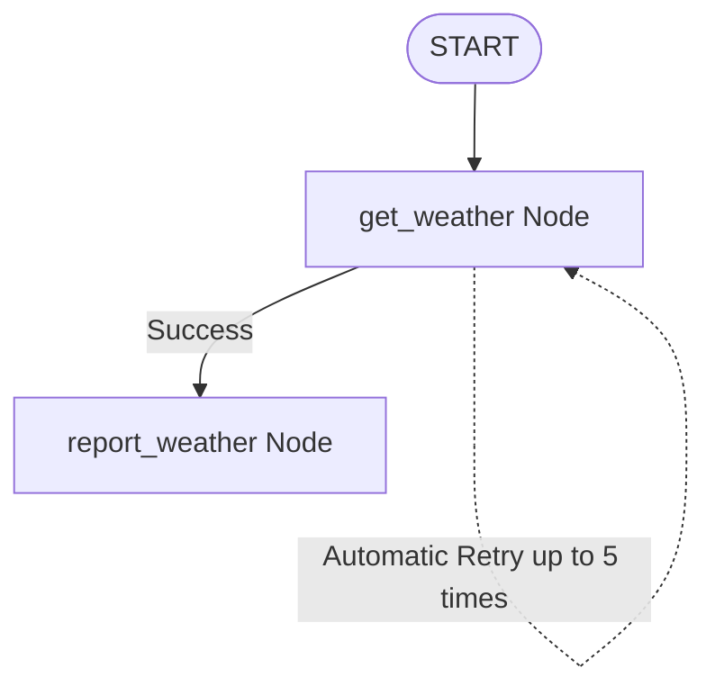

# ADK Task Retry Workflow

This project demonstrates how to incorporate automatic **task retrying** into your workflows using the **Google Antigravity SDK (ADK)**. 

It showcases how to configure a node to automatically retry when it encounters unexpected exceptions (such as network `HTTPError`s or server flakiness) before propagating the error downstream.

---

## 🏗️ Workflow Architecture

The workflow is simple: it starts, runs a weather lookup node that fails randomly with a 70% probability, and then reports the final weather when it succeeds.



### Nodes & Config Definition

- **`get_weather`**:
  - A mock node decorated with `@node(retry_config=RetryConfig(max_attempts=5, initial_delay=1))`.
  - It simulates a flaky API request by raising an `HTTPError` 70% of the time.
  - It keeps track of the current retry attempt count via `ctx.attempt_count`.
- **`report_weather`**:
  - The downstream node that consumes the output of `get_weather` once it succeeds.

---

## 💡 How Task Retrying Works in ADK

You can configure automatic retry logic for any task by passing a `RetryConfig` to the `@node` decorator:

```python
@node(retry_config=RetryConfig(max_attempts=5, initial_delay=1))
def get_weather(ctx: Context) -> str:
    ...
```

### Configuration Parameters:
- **`max_attempts`**: The maximum number of times to run the node before failing the workflow execution (defaults to `1` / no retries).
- **`initial_delay`**: The duration (in seconds) to wait before attempting the first retry. Subsequent retries follow an exponential backoff strategy.
- **`ctx.attempt_count`**: The context tracks the current attempt number (starting at `1`), which allows you to inspect state or log attempt progress directly in your node.

---

## 🚀 Getting Started

### 📋 Prerequisites
Ensure your virtual environment is active:
```bash
source .venv/bin/activate
```

### 💻 Running the CLI Agent
To run the workflow directly inside the terminal and see the retry attempts:
```bash
.venv/bin/adk run retry
```

### 🌐 Running the Web UI
To visualize the graph and trace the execution live:
```bash
.venv/bin/adk web retry --port 8080
```
Then navigate your browser to:
👉 **[http://localhost:8080](http://localhost:8080)**
