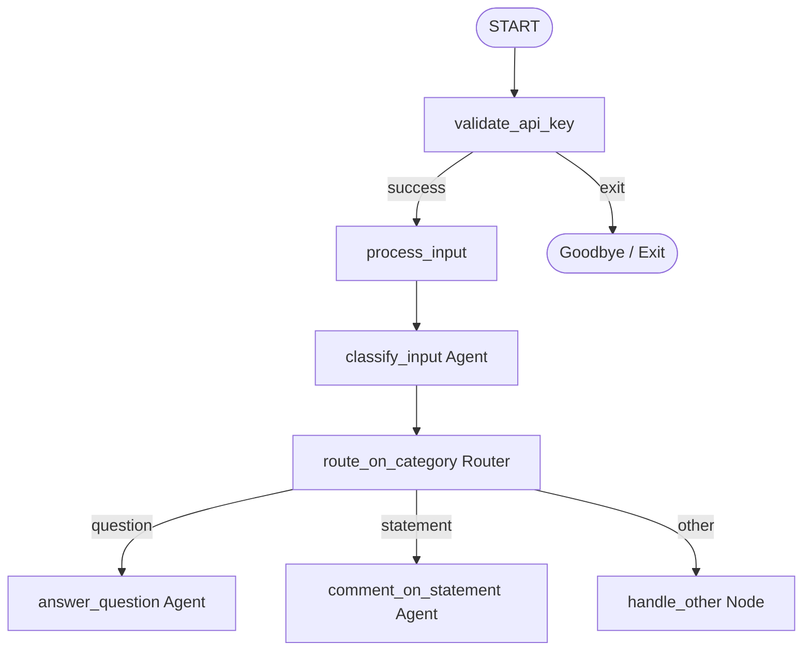

# ADK Routing and Categorization Workflow

This project demonstrates how to implement **dynamic, multi-path routing** based on structured LLM categorization in your workflows using the **Google Antigravity SDK (ADK)**.

It showcases how to classify a user's text input into categories (questions, statements, etc.) using an LLM agent with a Pydantic schema, and steer the workflow down different processing branches using routing keys.

---

## 🏗️ Workflow Architecture

The parent workflow (`route`) validates the Gemini API key, takes the user's input, runs it through an LLM classifier, and routes the execution flow depending on the detected category.



### Nodes & Models Definition

- **`InputCategory` (Pydantic Model)**:
  - Defines the categorization schema containing `category` (constrained to the literals `"question"`, `"statement"`, or `"other"`) and `language` (describing the input language).
- **`validate_api_key`**:
  - Prompts for and validates the Gemini API key.
- **`process_input`**:
  - Saves the user's raw text to the workflow state (`ctx.state["input"]`).
- **`classify_input` (Agent)**:
  - An LLM agent that reads the input and classifies it. It uses the `InputCategory` schema to enforce structured JSON output.
- **`route_on_category` (Router Node)**:
  - A routing node that reads the classification result and yields an `Event(route=...)` to determine the subsequent node.
- **`answer_question` / `comment_on_statement`**:
  - Downstream LLM agents specialized in responding to questions or commenting on statements, respectively.
- **`handle_other`**:
  - Fallback node for inputs that do not fall into the primary categories.

---

## 💡 How Routing Works in ADK

Conditional routing is achieved by mapping route keys yielded from a predecessor node to specific target nodes inside the workflow's `edges`:

```python
(
    route_on_category,
    {
        "question": answer_question,
        "statement": comment_on_statement,
        "other": handle_other,
    },
)
```

When `route_on_category` yields `Event(route="question")`, the ADK workflow runner automatically routes the next step to `answer_question`.

---

## 🚀 Getting Started

### 📋 Prerequisites
Ensure your virtual environment is active:
```bash
source .venv/bin/activate
```

### 💻 Running the CLI Agent
To run the workflow interactively directly inside the terminal:
```bash
.venv/bin/adk run route
```

### 🌐 Running the Web UI
To visualize the graph and trace the execution live:
```bash
.venv/bin/adk web route --port 8080
```
Then navigate your browser to:
👉 **[http://localhost:8080](http://localhost:8080)**
