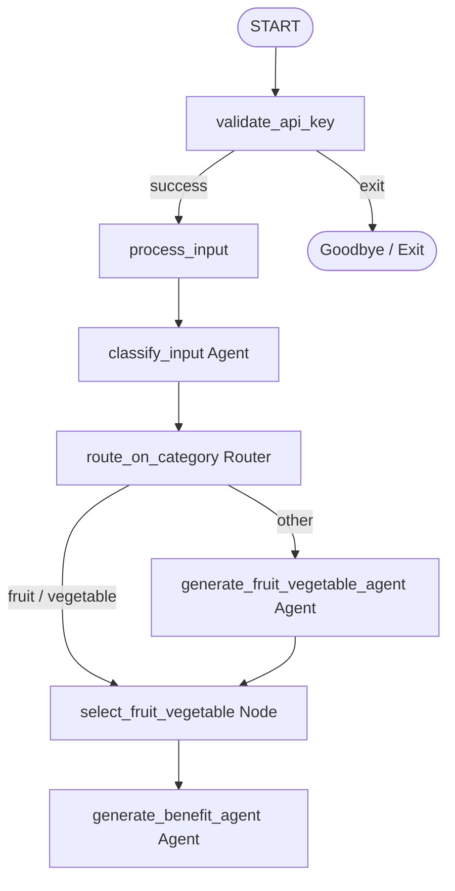

# ADK Sequential and Multi-Route Workflow

This project demonstrates how to implement **sequential workflows, conditional branching, and dynamic value resolution** using the **Google Antigravity SDK (ADK)**.

It showcases how to classify a user's text input (checking if they asked about a fruit/vegetable or something else), resolve the item name conditionally (using the user's raw input or generating a random item name), and feed the resolved item to a downstream agent to output its health benefits.

---

## 🏗️ Workflow Architecture

The parent workflow (`sequence`) validates the Gemini API key, takes the user's input, classifies it, resolves the target item, and fetches its health benefits.



### Nodes & Models Definition

- **`InputCategory` (Pydantic Model)**:
  - Defines the categorization schema containing `category` (constrained to the literals `"fruit"`, `"vegetable"`, or `"other"`).
- **`validate_api_key`**:
  - Prompts for and validates the Gemini API key.
- **`process_input`**:
  - Saves the user's raw text to the workflow state (`ctx.state["input"]`).
- **`classify_input` (Agent)**:
  - An LLM agent that reads the input and classifies it. It uses the `InputCategory` schema to enforce structured JSON output.
- **`route_on_category` (Router Node)**:
  - A routing node that reads the classification result and yields an `Event(route=...)` to route the execution flow.
- **`generate_fruit_vegetable_agent` (Agent)**:
  - An LLM agent that returns the name of a random fruit or vegetable.
- **`select_fruit_vegetable` (Node)**:
  - A custom resolution node that extracts the target item safely from either the user's input (if categorized as `"fruit"` or `"vegetable"`) or the generated output (if categorized as `"other"`).
- **`generate_benefit_agent` (Agent)**:
  - Downstream LLM agent that outputs the health benefits of the selected fruit or vegetable.

---

## 💡 How Dynamic Value Resolution Works in ADK

When a downstream node (like `generate_benefit_agent`) needs an item name that can come from different branches (user input vs. agent generated), we route both branches to a custom resolution node:

```python
Edge(
    from_node=route_on_category,
    to_node=select_fruit_vegetable,
    route=["fruit", "vegetable"]
),
Edge(
    from_node=route_on_category,
    to_node=generate_fruit_vegetable_agent,
    route="other"
),
(generate_fruit_vegetable_agent, select_fruit_vegetable),
(select_fruit_vegetable, generate_benefit_agent),
```

The `select_fruit_vegetable` node resolves the value, stores it in `ctx.state["selected_fruit_vegetable"]`, and passes it forward.

---

## 🚀 Getting Started

### 📋 Prerequisites
Ensure your virtual environment is active:
```bash
source .venv/bin/activate
```

### 💻 Running the CLI Agent
To run the workflow interactively directly inside the terminal:
```bash
.venv/bin/adk run sequence
```

### 🌐 Running the Web UI
To visualize the graph and trace the execution live:
```bash
.venv/bin/adk web sequence --port 8080
```
Then navigate your browser to:
👉 **[http://localhost:8080](http://localhost:8080)**
