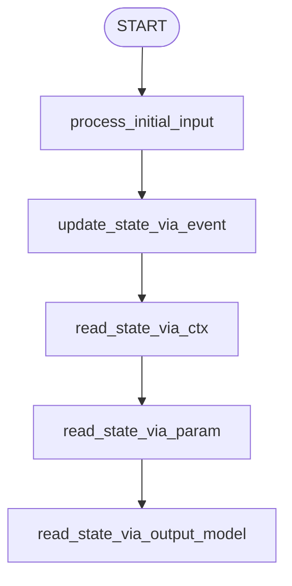

# ADK Workflow State Management

This project demonstrates the different ways to **write, read, and manage shared state** across nodes in a workflow using the **Google Antigravity SDK (ADK)**.

It illustrates direct state modification via the `Context` object, state updates using events, automatic state parameter injection, and parsing structured Pydantic outputs between nodes.

---

## 🏗️ Workflow Architecture

The workflow is a linear sequence of nodes, each performing a different state operation:



### State Modification Techniques Demonstrated:

1. **Direct Modification via `ctx.state`**:
   - Nodes can write directly to the persistent shared dictionary:
     ```python
     ctx.state["original_text"] = node_input
     ```
2. **Implicit State Updates via Events**:
   - Nodes can yield an `Event` containing a `state` dictionary to update variables:
     ```python
     yield Event(state={"uppercased_text": node_input.upper()})
     ```
3. **Direct Read via `ctx.state`**:
   - Retrieve variables directly from the dictionary:
     ```python
     original = ctx.state["original_text"]
     ```
4. **Automatic Parameter Injection**:
   - If a function parameter name matches a key in `ctx.state`, the SDK automatically resolves and injects that state variable at invocation time:
     ```python
     def read_state_via_param(ctx, appended_text: str):
         # appended_text is automatically injected from ctx.state["appended_text"]
         ...
     ```
5. **Passing Structured Outputs (`BaseModel`)**:
   - Passing structured data models from one node to the next.

---

## 🚀 Getting Started

### 📋 Prerequisites
Ensure your virtual environment is active:
```bash
source .venv/bin/activate
```

### 💻 Running the CLI Agent
To run the workflow interactively directly inside the terminal:
```bash
.venv/bin/adk run state
```

### 🌐 Running the Web UI
To visualize the graph and trace the execution live:
```bash
.venv/bin/adk web state --port 8080
```
Then navigate your browser to:
👉 **[http://localhost:8080](http://localhost:8080)**
